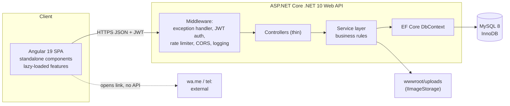
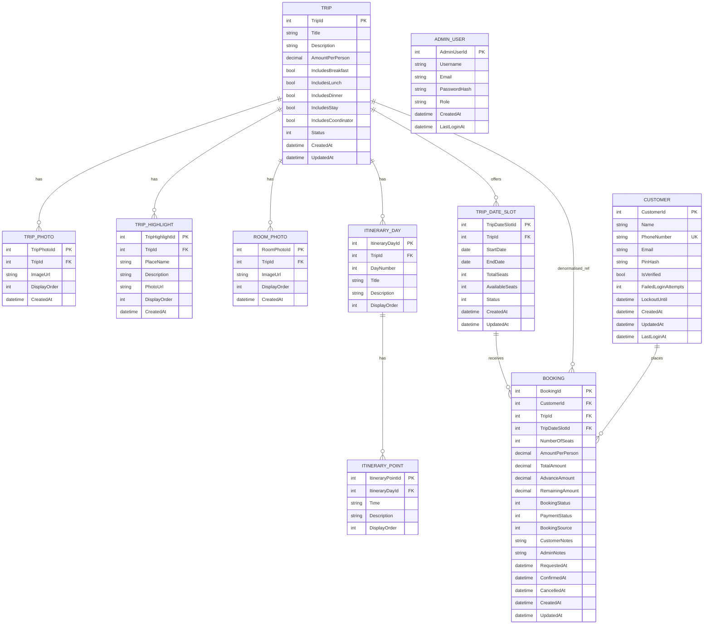
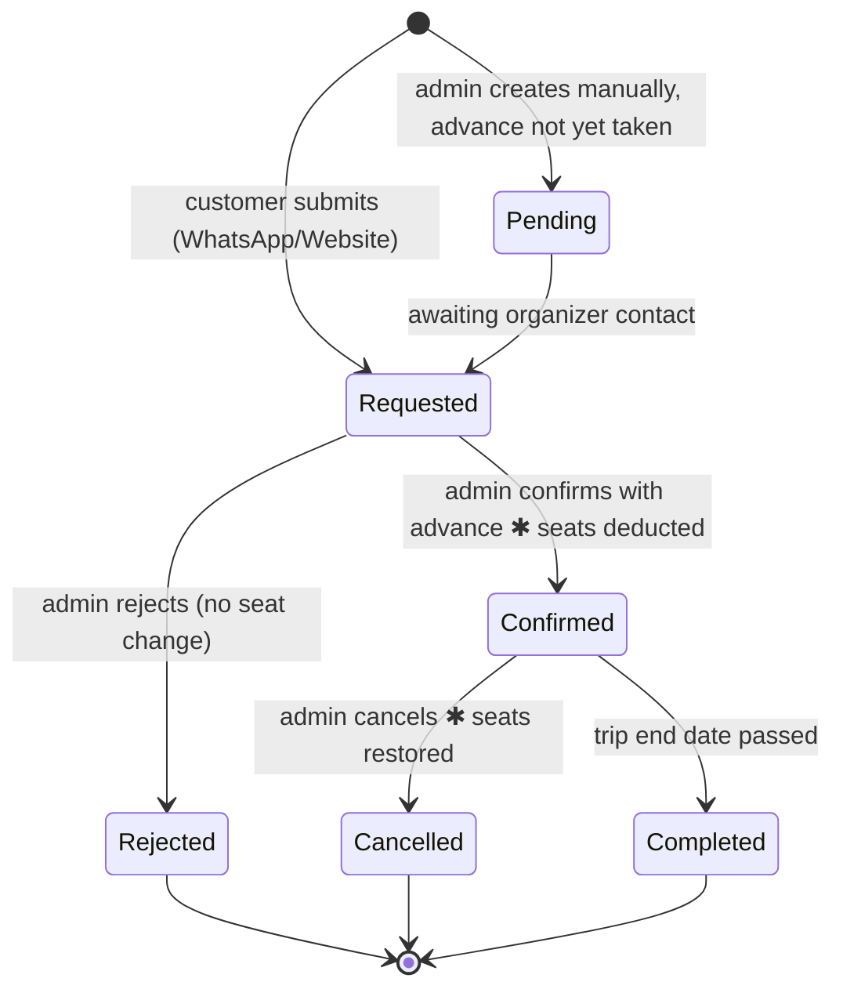
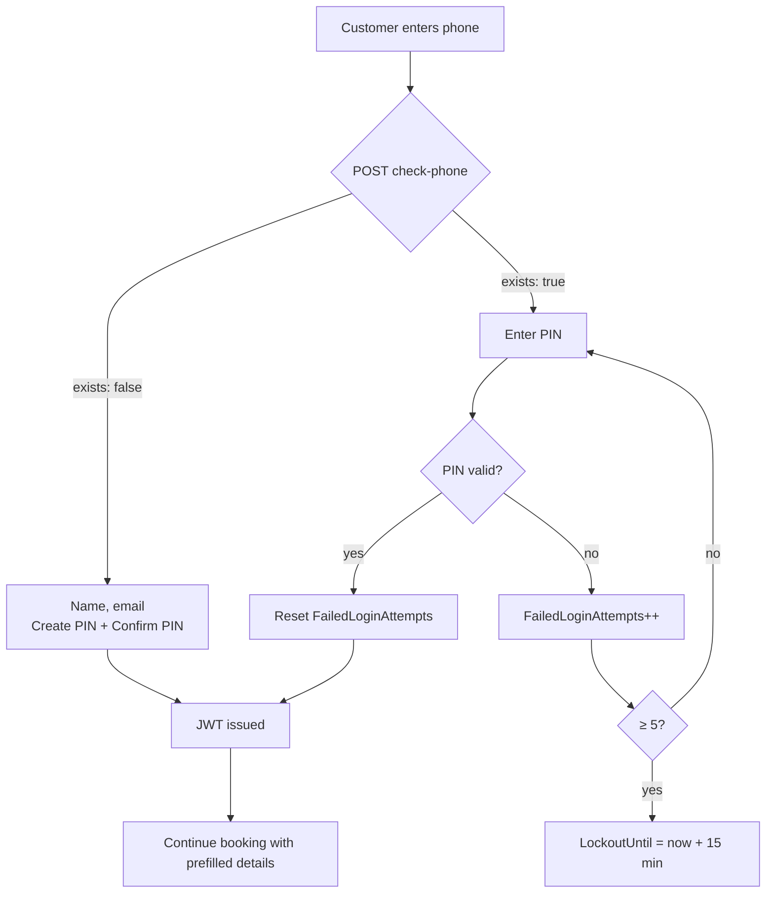

# Ghumo Odisha — Phase 1: Architecture

Production travel booking platform. Angular 19 + ASP.NET Core .NET 10 + MySQL 8.
Visual direction: **Variation B — modern minimal** (white ground, deep sea-green accent, Inter).

This document is Phase 1 only. No code yet. Approve it, or mark it up, and I'll start Phase 2.

---

## 1. High-level architecture

Three deployable pieces plus storage.



Layering rule: controllers validate shape and call a service; services own every business rule; EF Core is only reached from services. Nothing in Angular is trusted for price, seat count, or status.

**Request pipeline order:** CORS → exception handler → static files (`/uploads`) → rate limiter → authentication → authorization → controllers.

**Cross-cutting**
- `ApiResponse<T>` envelope on every endpoint (§82).
- Global exception middleware maps domain exceptions to status codes; stack traces never leave the server.
- Serilog to console + rolling file. PIN, PIN hash, and JWT never enter a log line.
- FluentValidation on every request DTO.

---

## 2. ER diagram



Two entities beyond your list, both needed and both small:

- **AdminUser** — §54 needs `POST /api/admin/auth/login` and §86 needs a seeded admin. Admins are not customers (no PIN, no bookings), so they get their own table.
- **Inclusion flags on Trip** — §42 says only show what is configured as included. Five booleans on Trip is cheaper than a lookup table and matches the fixed list in your spec. If you expect the list to grow, say so and I'll make it `TripInclusion` rows instead.

---

## 3. Relationships, keys, constraints

| Relationship | Cardinality | On delete |
|---|---|---|
| Trip → TripPhoto / TripHighlight / RoomPhoto / ItineraryDay / TripDateSlot | 1 : N | Cascade |
| ItineraryDay → ItineraryPoint | 1 : N | Cascade |
| TripDateSlot → Booking | 1 : N | Restrict |
| Trip → Booking | 1 : N | Restrict |
| Customer → Booking | 1 : N | Restrict |

Bookings are financial history, so nothing that owns a booking can be hard-deleted. Trip "delete" in the admin UI is a status change to `Inactive` (soft delete); the API keeps `DELETE /api/admin/trips/{id}` as the verb but the service refuses when confirmed bookings exist and otherwise deactivates.

**Check constraints (MySQL 8 enforces these):**
- `TripDateSlot`: `TotalSeats > 0`, `AvailableSeats >= 0`, `AvailableSeats <= TotalSeats`, `EndDate >= StartDate`
- `Booking`: `NumberOfSeats > 0`, `AdvanceAmount >= 0`, `AdvanceAmount <= TotalAmount`, `RemainingAmount = TotalAmount - AdvanceAmount`
- `Trip`: `AmountPerPerson >= 0`

Money is `decimal(10,2)`; seat counts are `int`; enums persist as `int` with an EF `HasConversion`. Timestamps are UTC `datetime(6)`.

**Indexes (§81)**

| Table | Index |
|---|---|
| Customer | `UNIQUE(PhoneNumber)`, `INDEX(Email)` |
| Trip | `INDEX(Status)` |
| TripDateSlot | `INDEX(TripId, StartDate)`, `INDEX(Status)` |
| Booking | `INDEX(CustomerId)`, `INDEX(TripId)`, `INDEX(TripDateSlotId, BookingStatus)`, `INDEX(BookingStatus)`, `INDEX(PaymentStatus)`, `INDEX(RequestedAt)` |
| TripPhoto / RoomPhoto / TripHighlight / ItineraryDay | `INDEX(TripId, DisplayOrder)` |
| ItineraryPoint | `INDEX(ItineraryDayId, DisplayOrder)` |

The composite `(TripDateSlotId, BookingStatus)` is what makes the §29 slot summary — confirmed seats, requested seats, booking count — a single indexed scan.

---

## 4. API endpoint map

Every response uses `{ success, message, data }` or `{ success, message, errors }`.

### Public

| Method | Route | Notes |
|---|---|---|
| GET | `/api/trips` | Active trips, paged. Returns next upcoming slot + seats for the card |
| GET | `/api/trips/{id}` | Full detail: photos, highlights, inclusions, itinerary, room photos, slots |
| GET | `/api/trips/{id}/date-slots` | Active slots only; sold-out flagged, not hidden |
| GET | `/api/contact` | Organizer name, phone, WhatsApp number, email |

### Auth

| Method | Route | Notes |
|---|---|---|
| POST | `/api/auth/customer/check-phone` | Returns `{ exists: bool }` so the UI shows login vs. create-PIN |
| POST | `/api/auth/customer/register` | Name, phone, email, PIN, confirm PIN → JWT |
| POST | `/api/auth/customer/login` | Phone + PIN → JWT. Rate-limited, lockout on repeat failure |
| POST | `/api/auth/customer/change-pin` | Authenticated. Current PIN + new PIN |
| POST | `/api/admin/auth/login` | Username + password → JWT with Admin role |

`check-phone` is a small enumeration surface. It's rate-limited per IP and returns only a boolean — no name, no masked email.

### Customer (role: Customer)

| Method | Route |
|---|---|
| POST | `/api/bookings/request` |
| GET | `/api/customer/bookings` |
| GET | `/api/customer/bookings/{id}` |
| GET | `/api/customer/profile` |
| PUT | `/api/customer/profile` |

### Admin — trips and content (role: Admin)

| Method | Route |
|---|---|
| GET / POST | `/api/admin/trips` |
| GET / PUT / DELETE | `/api/admin/trips/{id}` |
| POST | `/api/admin/trips/{id}/photos` |
| DELETE | `/api/admin/trip-photos/{id}` |
| PUT | `/api/admin/trip-photos/{id}/order` |
| POST | `/api/admin/trips/{id}/highlights` |
| PUT / DELETE | `/api/admin/highlights/{id}` |
| POST | `/api/admin/trips/{id}/date-slots` |
| PUT / DELETE | `/api/admin/date-slots/{id}` |
| POST | `/api/admin/trips/{id}/itinerary-days` |
| PUT / DELETE | `/api/admin/itinerary-days/{id}` |
| POST | `/api/admin/itinerary-days/{id}/points` |
| PUT / DELETE | `/api/admin/itinerary-points/{id}` |
| POST | `/api/admin/trips/{id}/room-photos` |
| DELETE | `/api/admin/room-photos/{id}` |
| PUT | `/api/admin/room-photos/{id}/order` |

### Admin — bookings, customers, dashboard

| Method | Route |
|---|---|
| GET / POST | `/api/admin/bookings` |
| GET | `/api/admin/bookings/{id}` |
| POST | `/api/admin/bookings/{id}/confirm` |
| POST | `/api/admin/bookings/{id}/reject` |
| POST | `/api/admin/bookings/{id}/cancel` |
| GET | `/api/admin/trips/{id}/bookings` |
| GET | `/api/admin/date-slots/{id}/bookings` |
| GET | `/api/admin/customers` |
| GET | `/api/admin/customers/{id}` |
| GET | `/api/admin/customers/{id}/bookings` |
| GET | `/api/admin/dashboard` |

`/api/admin/dashboard` returns all eight §24 counters plus upcoming trips, recent requests, and recently confirmed bookings in one call — one round trip for the whole screen.

---

## 5. Angular route structure

```
''                        → CustomerLayout
  ''                      → HomePage            (trip list)
  'trips'                 → TripListPage
  'trips/:id'             → TripDetailsPage     (lazy chunk)
  'login'                 → CustomerAuthPage
  'my-bookings'           → MyBookingsPage      [customerGuard]
  'profile'               → ProfilePage         [customerGuard]

'admin'                   → AdminLayout          (lazy feature area)
  'login'                 → AdminLoginPage
  'dashboard'             → DashboardPage       [adminGuard]
  'trips'                 → AdminTripListPage   [adminGuard]
  'trips/add'             → TripFormPage        [adminGuard]
  'trips/:id'             → AdminTripDetailsPage[adminGuard]
  'trips/:id/edit'        → TripFormPage        [adminGuard]
  'bookings'              → AdminBookingListPage[adminGuard]
  'bookings/add'          → AdminBookingFormPage[adminGuard]
  'bookings/:id'          → AdminBookingDetailsPage [adminGuard]
  'customers'             → AdminCustomerListPage   [adminGuard]
  'customers/:id'         → AdminCustomerDetailsPage[adminGuard]

'**'                      → NotFoundPage
```

Two lazy bundles: `features/trips` and the whole of `features/admin`. A customer never downloads admin code. `TripFormPage` serves both add and edit — same reactive form, different resolver — so §27 and §28 can't drift apart.

Guards are functional (`CanActivateFn`). `authInterceptor` attaches the JWT and redirects to the matching login on 401; `errorInterceptor` turns a failed envelope into a toast.

---

## 6. Admin page structure

Shell: fixed sidebar (Dashboard, Trips, Bookings, Customers) + header with admin name and sign out. Content max-width 1280, 24px gutters.

| Page | Contents |
|---|---|
| Dashboard | 8 StatCards, upcoming trips list, recent requests table, recently confirmed table |
| Trips | Searchable table: name, price, next date, total/available seats, confirmed bookings, status; row actions View / Edit / Bookings / Manage dates / Deactivate |
| Add / Edit trip | Seven sections (§27 A–G) as separate child components inside one `FormGroup`; photos and highlights and days and points are `FormArray`s with add/remove/reorder |
| Trip details | Trip content, then a slot panel per date range (total / available / confirmed / requested / bookings), then the booked-customers table |
| Bookings | Filters (status, payment, trip, date) + search (customer, phone, trip), paginated table |
| Booking details | Customer block, trip block, money block, status block, timestamps, notes; actions Confirm / Reject / Cancel |
| Confirm modal | Read-only summary, advance input, live remaining, single Confirm call |
| Create booking | Customer picker or new customer, trip → slot cascade, seats, advance, source, admin notes |
| Customers | Search by name/phone/email; aggregates per customer |
| Customer details | Profile block + full booking history table |

Editing seats in §28 is guarded twice: the form disables reducing `TotalSeats` below confirmed seats, and the backend rejects it anyway.

---

## 7. Customer page structure

Variation B applied: white ground, `#0F1416` ink, `#0F6F5C` accent, 14px radius, 1px `#E7E9EA` borders, Inter at 600/500/400, photography carrying the colour.

| Page | Contents |
|---|---|
| Home / Trips | Hero strip, trip grid 3/2/1 columns, each card a photo carousel + name + duration + price + next date + seats + "View full itinerary" |
| Trip details | The §77 order, exactly: hero carousel → title and price → what you'll see → what's included → itinerary timeline → accommodation → choose your date → choose seats → booking summary → account step → Book via WhatsApp → organizer contact |
| Login | Phone first, then PIN or create-PIN depending on `check-phone` |
| My bookings | Status-grouped cards with amounts and a per-booking detail sheet |
| Profile | Name, phone, email, joined date, edit, change PIN |

On mobile the trip-details booking block (date → seats → summary → CTA) collapses into a sticky bottom bar showing the live total and the WhatsApp button; on desktop it's a sticky right column beside the content.

**Design tokens carried from Variation B**

```
--bg #FFFFFF   --surface #FFFFFF  --ink #0F1416   --muted #6A7478
--line #E7E9EA --accent #0F6F5C   --accent-ink #FFFFFF
--ok #0F6F5C   --wait #9A6A11     --danger #C0483A
radius 14 card / 12 control / 999 pill      type Inter 600·500·400
```

The admin side reuses the same tokens on a `#F7F8F8` canvas — same components, denser spacing.

---

## 8. Booking lifecycle



Seats move on exactly two transitions, both marked ✱. Nothing else touches `AvailableSeats`.

Payment status tracks separately: `Unpaid` on request → `AdvancePaid` when advance is between 0 and total → `Paid` when advance equals total → `Refunded` after a cancellation with money returned.

`Completed` is set by a small hosted background service that runs daily and promotes confirmed bookings whose slot `EndDate` has passed.

---

## 9. Offline advance and confirmation workflow

```mermaid
sequenceDiagram
  participant C as Customer
  participant NG as Angular
  participant API as Web API
  participant DB as MySQL
  participant O as Organizer

  C->>NG: pick slot, seats, details
  NG->>API: POST /api/bookings/request
  API->>DB: read Trip.AmountPerPerson, validate slot
  API->>DB: INSERT Booking (Requested, Unpaid) — seats untouched
  API-->>NG: booking + WhatsApp message text
  NG->>C: open wa.me with prefilled message
  C->>O: sends message, pays advance offline
  O->>API: Admin → booking → Confirm (advance ₹5,000)
  API->>DB: BEGIN; lock slot; check seats; deduct; set Confirmed; COMMIT
  API-->>O: success (or "Only N seats are currently available.")
```

The request endpoint returns the WhatsApp text from the server so the message format lives in one place, not in a component. The number comes from `OrganizerContactOptions`, same source as `GET /api/contact`.

---

## 10. Seat deduction and concurrency strategy

`ConfirmBookingAsync` is the only method in the codebase that decreases seats, and `CancelBookingAsync` the only one that increases them. Manual admin bookings (§19) call the identical service method.

**Confirm, inside one transaction at `ReadCommitted`:**

1. Load booking. Reject unless status is `Requested` or `Pending` — this alone makes double-confirm impossible.
2. Lock the slot row: `SELECT ... FROM TripDateSlots WHERE TripDateSlotId = @id FOR UPDATE`.
3. Recompute money from the database: `TotalAmount = Trip.AmountPerPerson × NumberOfSeats`. The value in the request body is ignored.
4. Validate `0 ≤ AdvanceAmount ≤ TotalAmount`; `RemainingAmount = TotalAmount − AdvanceAmount`.
5. Guarded deduct — the real defence:

```sql
UPDATE TripDateSlots
   SET AvailableSeats = AvailableSeats - @seats,
       UpdatedAt = UTC_TIMESTAMP(6)
 WHERE TripDateSlotId = @slotId
   AND AvailableSeats >= @seats;
```

   If affected rows ≠ 1, throw `InsufficientSeatsException` → rollback → booking stays `Requested`, message "Only N seats are currently available."
6. Set `Confirmed`, payment status, `ConfirmedAt`, `AdvanceAmount`, `RemainingAmount`, `AmountPerPerson`.
7. Save, commit.

The `AvailableSeats >= @seats` predicate is evaluated by MySQL under the row lock, so the check-then-write race cannot open. `FOR UPDATE` serialises the two admins; the guarded UPDATE is the backstop if a future code path forgets the lock; the CHECK constraint `AvailableSeats >= 0` is the last line. Your §89 scenario (16 seats, confirm 10, then try 7) fails at step 5 with 6 remaining.

**Cancel** mirrors it: status must be `Confirmed` — a second cancel is rejected on status, not on arithmetic, which is what keeps §90 at 16 — then

```sql
UPDATE TripDateSlots
   SET AvailableSeats = LEAST(AvailableSeats + @seats, TotalSeats)
 WHERE TripDateSlotId = @slotId;
```

**Reducing TotalSeats (§28)** runs in the same locked pattern: `SELECT FOR UPDATE`, sum confirmed seats for the slot, refuse if `newTotal < confirmedSeats`, otherwise set `AvailableSeats = newTotal − confirmedSeats`.

---

## 11. Phone + PIN authentication



- PIN is 6 numeric digits, hashed with ASP.NET Core `PasswordHasher` (PBKDF2, per-user salt, iteration count in config). Never stored, returned, or logged in plaintext.
- Failed login returns one generic message whether the phone or the PIN is wrong.
- Lockout: 5 failures → 15 minutes, cleared on success. Plus a fixed-window rate limiter of 5 attempts per phone per minute and 20 per IP per minute.
- No PIN reset endpoint in v1. The UI says: contact Ghumo Odisha on the organizer number. `IOtpSender` is defined and unregistered so the reset flow drops in later without touching the auth service shape.
- JWT: `sub` = CustomerId, `role` = Customer, 7-day expiry, separate short-lived token for Admin (8 hours). Issuer, audience, signing key and lifetime all from configuration; nothing committed.
- Every customer endpoint reads the id from the token claim, never from a route or body parameter — that is what closes §61.

---

## 12. Organizer contact workflow

One source of truth: an `OrganizerContact` section in configuration (name, role, phone, WhatsApp number, email), bound to `OrganizerContactOptions`, served by `GET /api/contact`, cached in an Angular `ContactService` signal, consumed by the `OrganizerContact` component.

- **Call now** → `tel:+91XXXXXXXXXX`. On desktop the component shows the number as copyable text alongside the link so a dead click never happens.
- **WhatsApp** → `https://wa.me/91XXXXXXXXXX?text=<encoded>`, encoded with `encodeURIComponent`.
- The number appears in the component and the booking service only. No component ever hardcodes it. Moving it to a database table later means changing the service behind `GET /api/contact` and nothing else.

---

## 13. Folder structure

```
ghumo-odisha/
├─ backend/
│  ├─ GhumoOdisha.Api/          Controllers, Program.cs, middleware, wwwroot/uploads
│  ├─ GhumoOdisha.Application/  DTOs, service interfaces + implementations,
│  │                            validators, mapping, domain exceptions
│  ├─ GhumoOdisha.Domain/       Entities, enums
│  ├─ GhumoOdisha.Infrastructure/ DbContext, EF configurations, migrations,
│  │                            seeding, image storage, PIN hasher, JWT
│  └─ GhumoOdisha.Tests/        Service + API integration tests
├─ frontend/
│  └─ src/app/
│     ├─ core/          interceptors, guards, api services, models, tokens
│     ├─ shared/        TripCard, TripCarousel, SeatSelector, StatCard,
│     │                 StatusBadge, ConfirmDialog, Toast,
│     │                 Loading/Empty/Error states
│     ├─ features/
│     │  ├─ trips/      home, list, details + booking sub-components
│     │  ├─ auth/       phone+PIN flow
│     │  ├─ account/    my-bookings, profile
│     │  └─ admin/      dashboard, trips, bookings, customers
│     ├─ layouts/       customer-layout, admin-layout
│     └─ environments/  environment.ts, environment.prod.ts
├─ e2e/                 Playwright specs + screenshot runner
├─ ui-snapshots/        customer/{desktop,mobile}, admin/{desktop,mobile}
└─ README.md
```

---

## 14. Implementation order

| Phase | Deliverable | Gate before moving on |
|---|---|---|
| 2 | Entities, DbContext, configurations, `InitialCreate` migration, seed data | `dotnet build`, `dotnet ef database update`, rows visible in MySQL |
| 3 | JWT, admin login, customer register/login, hashing, lockout, guards, interceptor | Auth tests green; 401/403 verified |
| 4 | Trip CRUD, photos, highlights, slots, itinerary, room photos, uploads | Swagger round trip on every endpoint |
| 5 | Booking request, confirm, reject, cancel, manual booking, concurrency | Oversell + cancel + price-manipulation tests green |
| 6 | Admin frontend, all ten pages | `ng build` clean |
| 7 | Customer frontend in Variation B | `ng build` clean |
| 8 | Wire Angular to the live API, remove every placeholder | Full app runs against MySQL |
| 9 | `dotnet build`, `ng build`, API tests, Playwright critical flows | All green |
| 10 | Real desktop 1440×900 and mobile 390×844 screenshots | Every §94 file present |
| 11 | Screenshot review, fix, regenerate, README | §103 acceptance list satisfied |

---

## Decisions I need from you

1. **Palette conflict.** Your §35/§69 say dark green/black + cream + warm orange; you chose Variation B, which is white + sea green. I've assumed B wins. Confirm, or tell me to keep §35.
2. **Inclusions.** Five booleans on Trip, or a `TripInclusion` table if the list will grow past breakfast/lunch/dinner/stay/coordinator?
3. **Duration.** Trip cards show "2 Days / 1 Night". I'm deriving it from the selected slot's dates rather than storing it — so a 2-day and a 3-day slot on one trip both display correctly. Say if you'd rather it were a fixed field on Trip.
4. **Cars and Hotels.** §36 wants them navigable but not functional. I'll ship them as "Coming soon" pages in the nav with no fake data.
5. **Local MySQL.** Confirm you'll run `server=localhost;port=3306;database=GhumoOdisha`, or give me the host/port you want in `appsettings.Development.json`.

Approve and I'll start Phase 2: entities, DbContext, EF configurations, the initial migration, and seed data for Koraput Escape, Puri Konark Escape, and Mahendragiri Adventure.
